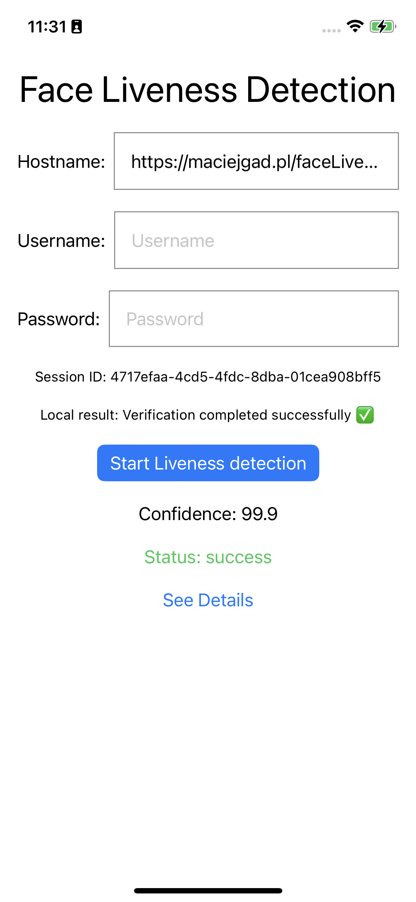

# Face Liveness Test


## iOS App
This is a sample app that uses [AWS Amplify UI](https://docs.amplify.aws/ui) for liveness detection using [Amazon Rekognition Face Liveness](https://aws.amazon.com/rekognition/). AWS Amplify UI provides a set of accessible, themeable, and performant components that can be used to build cloud-connected applications. 

For more information on how to get started with AWS Amplify UI, you can refer to the following tutorials:
- [Getting Started with AWS Amplify UI](https://docs.amplify.aws/swift/start/quickstart/)
- [Amplify UI Face Liveness](https://ui.docs.amplify.aws/swift/connected-components/liveness)
- [Amplify Documentation for Swift](https://docs.amplify.aws/swift/)

### Features
- **Real-time Face Detection**: Instantly detects faces in real-time.
- **Liveness Detection**: Verifies the authenticity of the face to ensure it is live.
- **User-friendly Interface**: Designed with a focus on ease of use and accessibility.

### Requirements
- **iOS 15 or later**: Compatible with devices running iOS 15 and above.
- **Xcode 16.0 or later**: Requires Xcode version 16.0 or higher for development.
- **AWS Account**: Necessary for backend services and integrations.

### Installation
1. **Clone the Repository**: Download the project files from the repository.
    ```sh
    git clone https://github.com/MaciejGad/FaceLivenessTest.git
    ```
2. **Open the Project in Xcode**: Navigate to the project directory and open it in Xcode.
    ```sh
    cd FaceLivenessTest/
    open FaceLivenessTest.xcodeproj
    ```
3. **Build and Run**: Compile the project and run it on your device or simulator.

### Screenshots

1. Start screen


2. In progress


3. Success



## Backend

The backend infrastructure provides essential APIs to facilitate the liveness detection features of the iOS app. It processes incoming data from the app and returns the necessary results.

### Requirements
- **Python 3.8 or later**: Requires Python version 3.8 or higher.
- **Flask 1.1.2 or later**: Requires Flask version 1.1.2 or higher.

### Installation
1. **Clone the Repository**: Download the backend project files from the repository.
    ```sh
    git clone https://github.com/MaciejGad/FaceLivenessTest.git
    ```
2. **Navigate to the Backend Directory**: Change to the backend directory.
    ```sh
    cd FaceLivenessTest/backend
    ```
3. **Install Dependencies**: Install the necessary Python packages.
    ```sh
    /usr/bin/python3 -m pip install -r requirements.txt
    ```
4. **Run the Server Locally**: Start the backend server with the required environment variables.
    ```sh
    FACE_AUTH_USER=user FACE_AUTH_PASS=pass /usr/bin/python3 app.py --local
    ```

### API Endpoints / Pages
- `GET /create_liveness_session`: Initiates a new liveness session.
- `GET /get_liveness_result/<session_id>`: Retrieves the results of a liveness check.
- `GET /details/<session_id>`: Provides detailed information about a specific session.
- `GET /`: Lists all liveness checks.
- `GET /login`: Displays the login page.

### Authorization

All requests must be authenticated using basic authentication or by setting a cookie with the username and password.